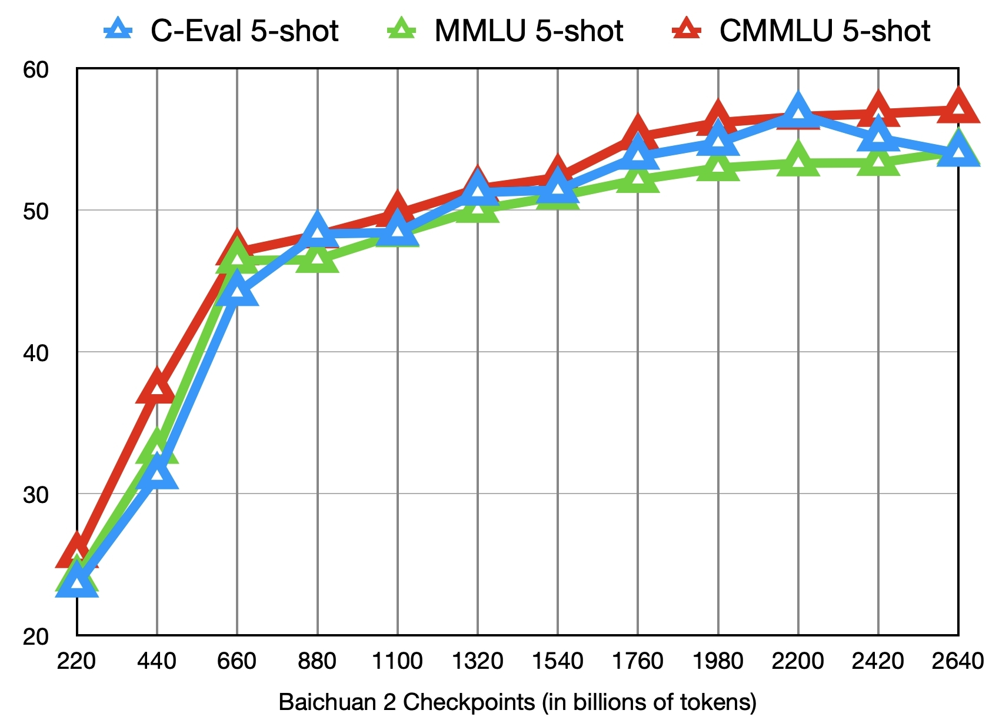

<!-- markdownlint-disable first-line-h1 -->
<!-- markdownlint-disable html -->

<div align="center">
<h1>
  Baichuan2
</h1>
</div>

<p align="center">
🤗 <a href="https://huggingface.co/baichuan-inc/" target="_blank">Hugging Face</a> • 🤖 <a href="https://modelscope.cn/organization/baichuan-inc" target="_blank">ModelScope</a> • 💬 <a href="https://github.com/baichuan-inc/Baichuan-7B/blob/main/media/wechat.jpeg?raw=true" target="_blank">WeChat</a>
</p>

<div align="center">

[](https://github.com/baichuan-inc/Baichuan2/blob/main/LICENSE)
<h4 align="center">
    <p>
        <b>English</b> |
        <a href="https://github.com/baichuan-inc/Baichuan2/blob/main/README.md">中文</a>
    <p>
</h4>
</div>

# Table of Contents

- [Introduction](#Introduction)
- [Benchmark Results](#Benchmark-Results)
- [Inference and Deployment](#Inference-and-Deployment)
- [Fine-tuning the Model](#Fine-tuning-the-Model)
- [Intermediate Checkpoints](#Intermediate-Checkpoints)
- [Community and Ecosystem](#Community-and-Ecosystem)
- [Disclaimer](#Disclaimer)
- [License](#License)

# Introduction

Baichuan2 is an updated version released by Baichuan Intelligence after Baichuan-7B and Baichuan-13B. It was trained on a high-quality corpus with 2.64 trillion tokens, achieving the best results in both Chinese and English benchmarks of the same scale. This release includes Base and Chat versions for 7B and 13B, and a 4bits quantized version for the Chat model. All versions are fully open to academic research. Developers only need to apply via email and obtain official commercial permission to use it for free commercially. The specific released versions and download links are shown in the table below:

|         | Base Model  | Aligned Model | Aligned Model 4bits Quantized |
|:-------:|:-----------:|:-------------:|:-----------------------------:|
| 7B      | 🤗 [Baichuan2-7B-Base](https://huggingface.co/baichuan-inc/Baichuan2-7B-Base) | 🤗 [Baichuan2-7B-Chat](https://huggingface.co/baichuan-inc/Baichuan2-7B-Chat) | 🤗 [Baichuan2-7B-Chat-4bits](https://huggingface.co/baichuan-inc/Baichuan2-7B-Chat-4bits) |
| 13B     | 🤗 [Baichuan2-13B-Base](https://huggingface.co/baichuan-inc/Baichuan2-13B-Base) | 🤗 [Baichuan2-13B-Chat](https://huggingface.co/baichuan-inc/Baichuan2-13B-Chat) | 🤗 [Baichuan2-13B-Chat-4bits](https://huggingface.co/baichuan-inc/Baichuan2-13B-Chat-4bits) |

# Benchmark Results

We conducted extensive testing on authoritative Chinese-English datasets across six domains: general, legal, medical, mathematics, code, and multi-language translation.

## General Domain

In the general domain, we conducted 5-shot tests on the following datasets:
- [C-Eval](https://cevalbenchmark.com/index.html#home) is a comprehensive Chinese basic model evaluation dataset, covering 52 disciplines and four levels of difficulty. We used the dev set of this dataset as the source for few-shot learning and tested on the test set. Our evaluation approach followed that of [Baichuan-7B](https://github.com/baichuan-inc/Baichuan-7B/tree/main).
- [MMLU](https://arxiv.org/abs/2009.03300) is an English evaluation dataset comprising 57 tasks, encompassing elementary math, American history, computer science, law, etc. The difficulty ranges from high school level to expert level. It's a mainstream LLM evaluation dataset. We used its [open-source](https://github.com/hendrycks/test) evaluation approach.
- [CMMLU](https://github.com/haonan-li/CMMLU) is a comprehensive Chinese evaluation benchmark covering 67 topics, specifically designed to assess language models' knowledge and reasoning capabilities in a Chinese context. We adopted its [official](https://github.com/haonan-li/CMMLU) evaluation approach.
- [Gaokao](https://github.com/OpenLMLab/GAOKAO-Bench) is a dataset utilizing China's college entrance examination questions to evaluate large language models' abilities, focusing on linguistic proficiency and logical reasoning. We retained only its single-choice questions and conducted random partitioning. Our evaluation method is similar to that of C-Eval.
- [AGIEval](https://github.com/microsoft/AGIEval) aims to evaluate a model's general abilities in cognition and problem-solving related tasks. We retained only its four-option single-choice questions and did random partitioning. We used an evaluation scheme similar to C-Eval.
- [BBH](https://huggingface.co/datasets/lukaemon/bbh) is a challenging task subset of Big-Bench. Big-Bench currently includes 204 tasks. Task themes involve linguistics, child development, mathematics, common sense reasoning, biology, physics, societal biases, software development, etc. BBH consists of benchmark tasks extracted from the 204 Big-Bench tasks in which large models did not perform well.

### 7B 模型结果
|               | **C-Eval** | **MMLU** | **CMMLU** | **Gaokao** | **AGIEval** | **BBH** |
|:---------------------:|:----------:|:--------:|:---------:|:----------:|:-----------:|:-------:|
|               |  5-shot    |  5-shot  |  5-shot   | 5-shot     | 5-shot      | 3-shot  |
| **GPT-4**             | 68.40      | 83.93    | 70.33     | 66.15      | 63.27       | -       |
| **GPT-3.5-Turbo**     | 51.10      | 68.54    | 54.06     | 47.07      | 46.13       | -   |
| **LLaMA-7B**          | 27.10      | 35.10    | 26.75     | 27.81      | 28.17       | 32.38   |
| **LLaMA2-7B**         | 28.90      | 45.73    | 31.38     | 25.97      | 26.53       | 39.16   |
| **MPT-7B**            | 27.15      | 27.93    | 26.00     | 26.54      | 24.83       | -       |
| **Falcon-7B**         | 24.23      | 26.03    | 25.66     | 24.24      | 24.10       | -       |
| **ChatGLM2-6B**       | 50.20      | 45.90    | 49.00     | 49.44      | 45.28       | 31.65   |
| **Baichuan-7B**       | 42.80      | 42.30    | 44.02     | 36.34      | 34.44       | 32.48   |
| **Baichuan2-7B-Base**      | 54.00      | 54.16    | 57.07     | 47.47      | 42.73       | 41.56   |


### 13B 模型结果
|                     | **C-Eval** | **MMLU** | **CMMLU** | **Gaokao** | **AGIEval** | **BBH** |
|:---------------------------:|:----------:|:--------:|:---------:|:----------:|:-----------:|:-------:|
|                     |  5-shot    |  5-shot  |  5-shot   | 5-shot     | 5-shot      | 3-shot  |
| **GPT-4**                   | 68.40      | 83.93    | 70.33     | 66.15      | 63.27       | -       |
| **GPT-3.5-Turbo**           | 51.10      | 68.54    | 54.06     | 47.07      | 46.13       | -   |
| **LLaMA-13B**               | 28.50      | 46.30    | 31.15     | 28.23      | 28.22       | 37.89   |
| **LLaMA2-13B**              | 35.80      | 55.09    | 37.99     | 30.83      | 32.29       | 46.98   |
| **Vicuna-13B**              | 32.80      | 52.00    | 36.28     | 30.11      | 31.55       | 43.04   |
| **Chinese-Alpaca-Plus-13B** | 38.80      | 43.90    | 33.43     | 34.78      | 35.46       | 28.94   |
| **XVERSE-13B**              | 53.70      | 55.21    | 58.44     | 44.69      | 42.54       | 38.28   |
| **Baichuan-13B-Base**       | 52.40      | 51.60    | 55.30     | 49.69      | 43.20       | 43.01   |
| **Baichuan2-13B-Base**           | 58.10      | 59.17    | 61.97     | 54.33      | 48.17       | 48.78   |


## Law and Medicine
In the legal domain, we used the [JEC-QA](https://jecqa.thunlp.org/) dataset. The JEC-QA dataset originates from China's National Judicial Examination. We retained only the multiple-choice questions from it. Our evaluation method was similar to that of C-Eval.

In the medical domain, we used medical-related subjects from general domain datasets (C-Eval, MMLU, CMMLU), as well as [MedQA](https://arxiv.org/abs/2009.13081) and [MedMCQA](https://medmcqa.github.io/). We followed an evaluation scheme similar to C-Eval.
- The MedQA dataset comes from medical exams in the US, Mainland China, and Taiwan. We tested the USMLE and MCMLE subsets from the [MedQA dataset](https://huggingface.co/datasets/bigbio/med_qa), and used a version with five candidates.
- The MedMCQA dataset originates from entrance exams of medical colleges in India. We retained only the multiple-choice questions. Since the test set doesn't have answers, we used the dev set for testing.
- Medical-related subjects included in the general domain datasets are as follows:
    - C-Eval: clinical_medicine, basic_medicine
    - MMLU: clinical_knowledge, anatomy, college_medicine, college_biology, nutrition, virology, medical_genetics, professional_medicine
    - CMMLU: anatomy, clinical_knowledge, college_medicine, genetics, nutrition, traditional_chinese_medicine, virology 

We conducted 5-shot tests on the above datasets.


### 7B 模型结果

|             | **JEC-QA** | **CEval-MMLU-CMMLU** | **MedQA-USMLE** | **MedQA-MCMLE** | **MedMCQA** |
|:---------------------:|:----------:|:--------------------:|:---------------:|:---------------:|:-----------:|
|             | 5-shot     |  5-shot              |  5-shot         |  5-shot         | 5-shot      |
| **GPT-4**             | 59.32      | 77.16                | 80.28           | 74.58           | 72.51       |
| **GPT-3.5-Turbo**     | 42.31      | 61.17                | 53.81           | 52.92           | 56.25       |
| **LLaMA-7B**          | 27.45      | 33.34                | 24.12           | 21.72           | 27.45       |
| **LLaMA2-7B**         | 29.20      | 36.75                | 27.49           | 24.78           | 37.93       |
| **MPT-7B**            | 27.45      | 26.67                | 16.97           | 19.79           | 31.96       |
| **Falcon-7B**         | 23.66      | 25.33                | 21.29           | 18.07           | 33.88       |
| **ChatGLM2-6B**       | 40.76      | 44.54                | 26.24           | 45.53           | 30.22       |
| **Baichuan-7B**       | 34.64      | 42.37                | 27.42           | 39.46           | 31.39       |
| **Baichuan2-7B-Base** | 44.46      | 56.39                | 32.68           | 54.93           | 41.73       |


### 13B 模型结果
|                  | **JEC-QA** | **CEval-MMLU-CMMLU** | **MedQA-USMLE** | **MedQA-MCMLE** | **MedMCQA** |
|:---------------------------:|:----------:|:--------------------:|:---------------:|:---------------:|:-----------:|
|                   | 5-shot     |  5-shot              |  5-shot         |  5-shot         | 5-shot      |
| **GPT-4**                   | 59.32      | 77.16                | 80.28           | 74.58           | 72.51       |
| **GPT-3.5-Turbo**           | 42.31      | 61.17                | 53.81           | 52.92           | 56.25       |
| **LLaMA-13B**               | 27.54      | 35.14                | 28.83           | 23.38           | 39.52       |
| **LLaMA2-13B**              | 34.08      | 47.42                | 35.04           | 29.74           | 42.12       |
| **Vicuna-13B**              | 28.38      | 40.99                | 34.80           | 27.67           | 40.66       |
| **Chinese-Alpaca-Plus-13B** | 35.32      | 46.31                | 27.49           | 32.66           | 35.87       |
| **XVERSE-13B**              | 46.42      | 58.08                | 32.99           | 58.76           | 41.34       |
| **Baichuan-13B-Base**       | 41.34      | 51.77                | 29.07           | 43.67           | 39.60       |
| **Baichuan2-13B-Base**      | 47.40      | 59.33                | 40.38           | 61.62           | 42.86       |

## Mathematics and Code
In the mathematics domain, we used the [OpenCompass](https://opencompass.org.cn/) evaluation framework and conducted 4-shot tests on the [GSM8K](https://huggingface.co/datasets/gsm8k) and [MATH](https://huggingface.co/datasets/competition_math) datasets.

- GSM8K is a dataset released by OpenAI, consisting of 8.5K high-quality linguistically diverse elementary school math application questions. It requires selecting the most reasonable solution based on a given scenario and two possible solutions.
- The MATH dataset contains 12,500 math problems (of which 7,500 belong to the training set and 5,000 to the test set). These problems are collected from math competitions like AMC 10, AMC 12, AIME.

For the code domain, we used the [HumanEval](https://huggingface.co/datasets/openai_humaneval) and [MBPP](https://huggingface.co/datasets/mbpp) datasets. Using OpenCompass, we performed a 0-shot test on HumanEval and a 3-shot test on the MBPP dataset.
- Tasks in HumanEval include programming tasks encompassing language understanding, reasoning, algorithms, and basic math to evaluate the functional correctness of models and measure their problem-solving capability.
- MBPP consists of a dataset with 974 Python short functions, textual descriptions of programs, and test cases to check their functional correctness.

### 7B 模型结果
|               | **GSM8K** | **MATH** | **HumanEval** | **MBPP** |
|:---------------------:|:---------:|:--------:|:-------------:|:--------:|
|               |  4-shot   | 4-shot   |  0-shot       |  3-shot  |
| **GPT-4**             |   89.99   | 40.20    | 57.32         |  63.60   |
| **GPT-3.5 Turbo**     |   57.77   | 13.96    | 52.44         |  61.40   |
| **LLaMA-7B**          |   9.78    | 3.02     | 11.59         |  14.00   |
| **LLaMA2-7B**         |   16.22   | 3.24     | 12.80         |  14.80   |
| **MPT-7B**            |   8.64    | 2.90     | 14.02         |  23.40   |
| **Falcon-7B**         |   5.46    | 1.68     | -             |  10.20   |
| **ChatGLM2-6B**       |   28.89   | 6.40     | 9.15          |   9.00   |
| **Baichuan-7B**       |   9.17    | 2.54     | 9.20          |   6.60   |
| **Baichuan2-7B-Base**      |   24.49   | 5.58     | 18.29         |  24.20   |

### 13B 模型结果

|                     | **GSM8K** | **MATH** | **HumanEval** | **MBPP** |
|:---------------------------:|:---------:|:--------:|:-------------:|:--------:|
|                     |  4-shot   | 4-shot   |  0-shot       |  3-shot  |
| **GPT-4**                   |   89.99   | 40.20    | 57.32         |  63.60   |
| **GPT-3.5 Turbo**           |   57.77   | 13.96    | 52.44         |  61.40   |
| **LLaMA-13B**               |   20.55   | 3.68     | 15.24         |  21.40   |
| **LLaMA2-13B**              |   28.89   | 4.96     | 15.24         |  27.00   |
| **Vicuna-13B**              |   28.13   | 4.36     | 16.46         |  15.00   |
| **Chinese-Alpaca-Plus-13B** |   11.98   | 2.50     | 16.46         |  20.00   |
| **XVERSE-13B**              |   18.20   | 2.18     | 15.85         |  16.80   |
| **Baichuan-13B-Base**       |   26.76   | 4.84     | 11.59         |  22.80   |
| **Baichuan2-13B-Base**           |   52.77   | 10.08    | 17.07         |  30.20   |

## Multilingual
We used the [Flores-101](https://huggingface.co/datasets/facebook/flores) dataset to evaluate the multilingual capability of the model. Flores-101 covers 101 languages from around the world. Its data comes from various domains including news, travel guides, and books. We chose the official languages of the United Nations (Arabic, Chinese, English, French, Russian, and Spanish) as well as German and Japanese for testing. Using OpenCompass, we performed 8-shot tests on seven sub-tasks within Flores-101: Chinese-English, Chinese-French, Chinese-Spanish, Chinese-Arabic, Chinese-Russian, Chinese-Japanese, and Chinese-German.

### 7B 模型结果

|               | **中-英** | **中-法** | **中-西班牙** | **中-阿拉伯** | **中-俄** | **中-日** | **中-德** |
|:---------------------:|:-------:|:-------:|:---------:|:---------:|:-------:|:-------:|:-------:|
| **GPT-4**             | 29.94   | 29.56   | 20.01     | 10.76     | 18.62   | 13.26   | 20.83   |
| **GPT-3.5 Turbo**     | 27.67   | 26.15   | 19.58     | 10.73     | 17.45   | 1.82    | 19.70   |
| **LLaMA-7B**          | 17.27   | 12.02   | 9.54      | 0.00      | 4.47    | 1.41    | 8.73    |
| **LLaMA2-7B**         | 25.76   | 15.14   | 11.92     | 0.79      | 4.99    | 2.20    | 10.15   |
| **MPT-7B**            | 20.77   | 9.53    | 8.96      | 0.10      | 3.54    | 2.91    | 6.54    |
| **Falcon-7B**         | 22.13   | 15.67   | 9.28      | 0.11      | 1.35    | 0.41    | 6.41    |
| **ChatGLM2-6B**       | 22.28   | 9.42    | 7.77      | 0.64      | 1.78    | 0.26    | 4.61    |
| **Baichuan-7B**       | 25.07   | 16.51   | 12.72     | 0.41      | 6.66    | 2.24    | 9.86    |
| **Baichuan2-7B-Base**      | 27.27   | 20.87   | 16.17     | 1.39      | 11.21   | 3.11    | 12.76   |


### 13B 模型结果

|                             | **中-英** | **中-法** | **中-西班牙** | **中-阿拉伯** | **中-俄** | **中-日** | **中-德** |
|:---------------------------:|:-------:|:-------:|:---------:|:---------:|:-------:|:-------:|:-------:|
|          **GPT-4**          | 29.94   | 29.56   | 20.01     | 10.76     | 18.62   | 13.26   | 20.83   |
|      **GPT-3.5 Turbo**      | 27.67   | 26.15   | 19.58     | 10.73     | 17.45   | 1.82    | 19.70   |
|        **LLaMA-13B**        | 21.75   | 16.16   | 13.29     | 0.58      | 7.61    | 0.41    | 10.66   |
|       **LLaMA2-13B**        | 25.44   | 19.25   | 17.49     | 1.38      | 10.34   | 0.13    | 11.13   |
|       **Vicuna-13B**        | 22.63   | 18.04   | 14.67     | 0.70      | 9.27    | 3.59    | 10.25   |
| **Chinese-Alpaca-Plus-13B** | 22.53   | 13.82   | 11.29     | 0.28      | 1.52    | 0.31    | 8.13    |
|       **XVERSE-13B**        | 29.26   | 24.03   | 16.67     | 2.78      | 11.61   | 3.08    | 14.26   |
|    **Baichuan-13B-Base**    | 30.24   | 20.90   | 15.92     | 0.98      | 9.65    | 2.64    | 12.00   |
|      **Baichuan2-13B-Base**      | 30.61   | 22.11   | 17.27     | 2.39      | 14.17   | 11.58   | 14.53   |

# Inference and Deployment

The model weights, source code, and configuration needed for inference have been released on Hugging Face. Download links can be found in the table at the beginning of this document. Below, we demonstrate various inference methods using Baichuan2-13B-Chat as an example. The program will automatically download the required resources from Hugging Face.

Before inference, please install the dependencies:
```shell
pip install -r requirements.txt
```

## Python Code Inference

```python
>>> import torch
>>> from transformers import AutoModelForCausalLM, AutoTokenizer
>>> from transformers.generation.utils import GenerationConfig
>>> tokenizer = AutoTokenizer.from_pretrained("baichuan-inc/Baichuan2-13B-Chat", use_fast=False, trust_remote_code=True)
>>> model = AutoModelForCausalLM.from_pretrained("baichuan-inc/Baichuan2-13B-Chat", device_map="auto", torch_dtype=torch.bfloat16, trust_remote_code=True)
>>> model.generation_config = GenerationConfig.from_pretrained("baichuan-inc/Baichuan2-13B-Chat")
>>> messages = []
>>> messages.append({"role": "user", "content": "解释一下“温故而知新”"})
>>> response = model.chat(tokenizer, messages)
>>> print(response)
"温故而知新"是一句中国古代的成语，出自《论语·为政》篇。这句话的意思是：通过回顾过去，我们可以发现新的知识和理解。换句话说，学习历史和经验可以让我们更好地理解现在和未来。

这句话鼓励我们在学习和生活中不断地回顾和反思过去的经验，从而获得新的启示和成长。通过重温旧的知识和经历，我们可以发现新的观点和理解，从而更好地应对不断变化的世界和挑战。
```

> In the above code, the model loading specifies `device_map='auto'`, which will use all available GPUs. If you need to specify the device(s) to use, you can control it in a way similar to `export CUDA_VISIBLE_DEVICES=0,1` (using the 0 and 1 graphics cards).


## Command Line Tool Inference

```shell
python cli_demo.py
```

## Web Demo Inference

Run the following command using streamlit. It will start a web service locally. You can access it by entering the address provided in the console into your browser.

```shell
streamlit run web_demo.py
```

## Demo Results of Baichuan2-13B-Chat

<details><summary><b>Coding</b></summary>

```
User：写python代码，找到下列数组的中位数[3.1,6.2,1.3,8.4,10.5,11.6,2.1,5.9]

Baichuan2:
首先，我们需要对数组进行排序。然后，我们检查数组的元素个数是否等于奇数还是偶数，以确定中位数的计算方法。最后，返回中位数。
以下是实现这个功能的Python代码：
def find_median(arr):
    arr.sort()
    length = len(arr)

    if length % 2 == 0:
        median1 = arr[length // 2]
        median2 = arr[length // 2 - 1]
        median = (median1 + median2) / 2
    else:
        median = arr[length // 2]
    return median
Example usage:
arr = [3.1, 6.2, 1.3, 8.4, 10.5, 11.6, 2.1, 5.9]
print(find_median(arr))
在这个例子中，数组 [3.1, 6.2, 1.3, 8.4, 10.5, 11.6, 2.1, 5.9] 的中位数是 6.05。

```

</details>

<details><summary><b>Math</b></summary>
  
```
User：
鸡和兔在一个笼子里，共有35个头，94只脚，那么鸡有多少只，兔有多少只？

Baichuan2:
我们可以用代数方法来解决这个问题。设鸡的数量为x，兔子的数量为y。
根据题意我们可以得到以下两个方程：
1. x + y = 35 (头的总数)
2. 2x + 4y = 94 (脚的总数)
我们可以先求解第一个方程，得到 y = 35 - x。然后将这个结果代入第二个方程：
2x + 4(35 - x) = 94
化简后得到：
2x + 140 - 4x = 94
进一步整理得：
-2x = -46
所以 x = 23。这意味着有23只鸡。将 x 的值代回第一个方程，我们得到：
23 + y = 35
解得：
y = 12
所以，笼子里共有23只鸡和12只兔子。
```

</details>

<details><summary><b>Instruction Following</b></summary>

```
User：
从现在开始，你会翻译我说的每一句话，并且翻译的之前面都带上“translate：”，准备好了吗？

Baichuan2:
好的，我已经准备好为您翻译了。请随时开始说话，我会尽力准确翻译您的内容。

User：
你好

Baichuan2:
Translate: Hello.

User：
我是Baichuan2，很高兴认识大家

Baichuan2:
Translate: Hi, I am Baichuan2, nice to meet you all.

User：
希望通过大家的共同努力，早日迎接AGI时代的到来

Baichuan2:
Translate: I hope through the joint efforts of everyone, we can look forward to the arrival of the AGI era sooner.
```
</details>


## Performance of Inference （待 @wuzhiying 更新）

| Model       | tokens/s |
|-------------|:--------:|
| LLaMA-13B   | ？？     |
| Baichuan-13B| ？？    |

> Enviroment and params used in testing:


## 量化部署

为了让不同的用户以及不同的平台都能运行 Baichuan2 模型，我们针对 Baichuan2 模型做了相应地量化工作（包括 Baichuan2-7B-Chat 和 Baichuan2-13B-Chat），方便用户快速高效地在自己的平台部署 Baichuan2 模型。

### 量化方法

Baichuan2 的采用社区主流的量化方法：[BitsAndBytes](https://github.com/TimDettmers/bitsandbytes)方法。该方法可以保证量化后的效果基本不掉点，目前已经集成到 transformers 库里，并在社区得到了广泛应用。BitsAndBytes 支持 4bits 和 8bits 两种量化，其中 4bits 支持 FP4 和 NF4 两种格式，Baichuan2 选用 NF4 作为 4bits 量化的数据类型。  
  
基于该量化方法，Baichuan2支持在线量化和离线量化两种模式。

### 在线量化

对于在线量化，我们支持 8bits 和 4bits 量化，使用方式和 [Baichuan-13B](https://huggingface.co/baichuan-inc/Baichuan-13B-Chat) 项目中的方式类似，只需要先加载模型到 CPU 的内存里，再调用`quantize()`接口量化，最后调用 `cuda()`函数，将量化后的权重拷贝到 GPU 显存中。实现整个模型加载的代码非常简单，我们以 Baichuan2-7B-Chat 为例：

8bits 在线量化:
```python
model = AutoModelForCausalLM.from_pretrained("baichuan-inc/Baichuan2-7B-Chat", torch_dtype=torch.float16, trust_remote_code=True)
model = model.quantize(8).cuda() 
```
4bits 在线量化:
```python
model = AutoModelForCausalLM.from_pretrained("baichuan-inc/Baichuan2-7B-Chat", torch_dtype=torch.float16, trust_remote_code=True)
model = model.quantize(4).cuda() 
```
需要注意的是，在用 `from_pretrained` 接口的时候，用户一般会加上 `device_map = "auto"`，在使用在线量化时，需要去掉这个参数，否则会报错。

### 离线量化
为了方便用户的使用，我们提供了离线量化好的 4bits 的版本 [Baichuan2-7B-Chat-4bits](https://huggingface.co/baichuan-inc/Baichuan2-7B-Chat-4bits/tree/main)，供用户下载。
用户加载 Baichuan2-7B-Chat-4bits 模型很简单，只需要执行:
```python
model = AutoModelForCausalLM.from_pretrained("baichuan-inc/Baichuan2-7B-Chat-4bits", device_map="auto", trust_remote_code=True)
```
对于 8bits 离线量化，我们没有提供相应的版本，因为 HuggingFace transformers 库提供了相应的 API 接口，可以很方便的实现 8bits 量化模型的保存和加载。用户可以自行按照如下方式实现8bits的模型保存和加载：
```python
#模型保存，其中model_id为原始模型目录，quant8_saved_dir为8bits量化后的模型保存目录
model = AutoModelForCausalLM.from_pretrained(model_id, load_in_8bit=True, device_map="auto", trust_remote_code=True)
model.save_pretrained(quant8_saved_dir)

#模型加载
model = AutoModelForCausalLM.from_pretrained(quant8_saved_dir, device_map="auto", trust_remote_code=True)
```
### 量化效果
量化前后显存占用对比：
| Precision   | Baichuan2-7B GPU Mem (GB) |Baichuan2-13B GPU Mem (GB) |
|-------------|:------------:|:------------:|
| bf16 / fp16 | 14.0         | 25.9       |
| 8bits        | 8.0         | 14.2        |
| 4bits        | 5.1          | 8.6        |

量化后在各个 benchmark 上的结果和原始版本对比如下：

| Model 5-shot           | C-Eval | MMLU | CMMLU |
|------------------------|:------:|:----:|:-----:|
| Baichuan2-13B-Chat      | 56.74  | 57.32| 59.68  |
| Baichuan2-13B-Chat-4bits | 56.05   | 56.24 | 58.82  |
| Baichuan2-7B-Chat       | 54.35   | 52.93 | 54.99  |
| Baichuan2-7B-Chat-4bits | 53.04   | 51.72 | 52.84  |

可以看到，4bits 相对 bfloat16 掉点在 1~2 个点左右。

## CPU Deployment
Baichuan-13B supports CPU inference, but it should be emphasized that the inference speed on CPU will be very slow. Modify the model loading logic as follows:
```python
#以Baichuan2-7B-Chat为例
model = AutoModelForCausalLM.from_pretrained("baichuan-inc/Baichuan2-7B-Chat", torch_dtype=torch.float32, trust_remote_code=True)
```
## Migrating Inference Optimizations from Baichuan to Baichuan2
Given that many users have made various optimizations on Baichuan (Baichuan-7B, Baichuan-13B), such as compilation optimizations, quantization, etc., to seamlessly apply these enhancements to Baichuan2, users can perform an offline conversion on the Baichuan2 model. After this conversion, it can be treated as a Baichuan model. Specifically, users only need to use the script below to offline normalize the last `lm_head` layer of the Baichuan2 model and replace the "lm_head.weight". Once replaced, optimizations such as compilation can be applied to the converted model just like with the Baichuan model.
```python
import torch
import os
ori_model_dir = 'your baichuan2 model directory'
# 为了不覆盖原始模型，最好将转换后的模型save到另一个目录再替换
new_model_dir = 'your normalized lm_head weight baichuan2 model directory'
model = torch.load(os.path.join(ori_model_dir, 'pytorch_model.bin'))
lm_head_w = model['lm_head.weight']
lm_head_w = torch.nn.functional.normalize(lm_head_w)
model['lm_head.weight'] = lm_head_w
torch.save(model, os.path.join(new_model_dir, 'pytorch_model.bin'))
```


# 对模型进行微调

## 依赖安装
```shell
git clone https://github.com/baichuan-inc/Baichuan2.git
cd Baichuan2/fine-tune
pip install -r requirements.txt
```
- 如需使用 LoRA 等轻量级微调方法需额外安装 [peft](https://github.com/huggingface/peft)
- 如需使用 xFormers 进行训练加速需额外安装 [xFormers](https://github.com/facebookresearch/xformers)

## 单机训练

下面我们给一个微调 Baichuan2-7B-Base 的单机训练例子。

训练数据：`data/belle_chat_ramdon_10k.json`，该样例数据是从 [multiturn_chat_0.8M](https://huggingface.co/datasets/BelleGroup/multiturn_chat_0.8M) 采样出 1 万条，并且做了格式转换。主要是展示多轮数据怎么训练，不保证效果。


```shell
hostfile=""
deepspeed --hostfile=$hostfile fine-tune.py  \
    --report_to "none" \
    --data_path "data/belle_chat_ramdon_10k.json" \
    --model_name_or_path "baichuan-inc/Baichuan2-7B-Base" \
    --output_dir "output" \
    --model_max_length 512 \
    --num_train_epochs 4 \
    --per_device_train_batch_size 16 \
    --gradient_accumulation_steps 1 \
    --save_strategy epoch \
    --learning_rate 2e-5 \
    --lr_scheduler_type constant \
    --adam_beta1 0.9 \
    --adam_beta2 0.98 \
    --adam_epsilon 1e-8 \
    --max_grad_norm 1.0 \
    --weight_decay 1e-4 \
    --warmup_ratio 0.0 \
    --logging_steps 1 \
    --gradient_checkpointing True \
    --deepspeed ds_config.json \
    --bf16 True \
    --tf32 True
```

## 多机训练

多机训练只需要给一下 hostfile ，内容如下：
```
ip1 slots=8
ip2 slots=8
ip3 slots=8
ip4 slots=8
```
同时在训练脚本里面指定 hosftfile 的路径：
```shell
hostfile="/path/to/hostfile"
deepspeed --hostfile=$hostfile fine-tune.py  \
    --report_to "none" \
    --data_path "data/belle_chat_ramdon_10k.json" \
    --model_name_or_path "baichuan-inc/Baichuan2-7B-Base" \
    --output_dir "output" \
    --model_max_length 512 \
    --num_train_epochs 4 \
    --per_device_train_batch_size 16 \
    --gradient_accumulation_steps 1 \
    --save_strategy epoch \
    --learning_rate 2e-5 \
    --lr_scheduler_type constant \
    --adam_beta1 0.9 \
    --adam_beta2 0.98 \
    --adam_epsilon 1e-8 \
    --max_grad_norm 1.0 \
    --weight_decay 1e-4 \
    --warmup_ratio 0.0 \
    --logging_steps 1 \
    --gradient_checkpointing True \
    --deepspeed ds_config.json \
    --bf16 True \
    --tf32 True
```

## 轻量化微调

代码已经支持轻量化微调如 LoRA，如需使用仅需在上面的脚本中加入以下参数
```shell
--use_lora True
```
LoRA 具体的配置可见 `fine-tune.py` 脚本。
使用 LoRA 微调后可以使用下面的命令加载模型
```python
from peft import AutoPeftModelForCausalLM
model = AutoPeftModelForCausalLM.from_pretrained("output", trust_remote_code=True)
```

# Intermediate Checkpoints
In addition to the Baichuan2-7B-Base model with 2.64 trillion tokens, we also provide 11 other checkpoints (ranging from 0.22 to 2.42 trillion tokens) from before this for community research ([Download link](https://huggingface.co/baichuan-inc/Baichuan2-7B-Intermediate-Checkpoints)). The chart below shows the performance changes of these checkpoints on the C-Eval, MMLU, and CMMLU benchmarks:



# Community and Ecosystem

📢📢📢 **We will continuously update the support for Baichuan2 from the community and ecosystem here.**

## Huawei Ascend
### Pytorch Framework
Model Fine-tuning: Baichuan2 supports model fine-tuning based on Ascend NPU using PyTorch + DeepSpeed. Required modeling, README, and example scripts have been released: [Baichuan2-7B](https://gitee.com/ascend/ModelZoo-PyTorch/tree/master/PyTorch/built-in/foundation/Baichuan2/7B). Baichuan2-13B is under adaptation.

Inference Deployment: Baichuan2 supports Ascend NPU inference. Required modeling, README, and example scripts have been released: [Baichuan2-7B](https://gitee.com/ascend/ModelZoo-PyTorch/tree/master/ACL_PyTorch/built-in/foundation_models/baichuan2/7b), [Baichuan2-13B](https://gitee.com/ascend/ModelZoo-PyTorch/tree/master/ACL_PyTorch/built-in/foundation_models/baichuan2/13b).

### MindSpore Framework
[MindFormers](https://gitee.com/mindspore/mindformers) is a comprehensive development suite based on the MindSpore framework that supports large model training, fine-tuning, evaluation, inference, and deployment. [Baichuan2-7B / 13B](https://gitee.com/mindspore/mindformers/tree/dev/research/baichuan2) has been integrated into this suite, supporting users in model fine-tuning and deployment. For specific usage, please see the [README](https://gitee.com/mindspore/mindformers/tree/dev/research/baichuan2/baichuan2.md).

### Large Model Experience Platform
[Ascend Large Model Platform](https://xihe.mindspore.cn) based on Ascend's MindSpore AI framework, MindFormers large model development suite, and Ascend hardware computing power, has opened the capabilities of the [Baichuan2-7B](https://xihe.mindspore.cn/modelzoo/baichuan2_7b_chat) large model to the public. Everyone is welcome to experience it online.


# Disclaimer
We hereby declare that our team has not developed any applications based on Baichuan2 models, not on iOS, Android, the web, or any other platform. We strongly call on all users not to use Baichuan2 models for any activities that harm national / social security or violate the law. Also, we ask users not to use Baichuan2 models for Internet services that have not undergone appropriate security reviews and filings. We hope that all users can abide by this principle and ensure that the development of technology proceeds in a regulated and legal environment.

We have done our best to ensure the compliance of the data used in the model training process. However, despite our considerable efforts, there may still be some unforeseeable issues due to the complexity of the model and data. Therefore, if any problems arise due to the use of Baichuan2 open-source models, including but not limited to data security issues, public opinion risks, or any risks and problems brought about by the model being misled, abused, spread or improperly exploited, we will not assume any responsibility.

# License
The use of the source code in this repository follows the open-source license [Apache 2.0](https://github.com/baichuan-inc/Baichuan2/blob/main/LICENSE). Community use of the Baichuan2 model must adhere to the [Baichuan2 Model License Agreement](https://huggingface.co/baichuan-inc/Baichuan2-7B-Base/blob/main/Baichuan2%20%E6%A8%A1%E5%9E%8B%E8%AE%B8%E5%8F%AF%E5%8D%8F%E8%AE%AE.pdf). Baichuan2 supports commercial use. If you are using the Baichuan2 model or its derivatives for commercial purposes, please contact the licensor in the following manner for registration and to apply for written authorization: Email <opensource@baichuan-inc.com>.
